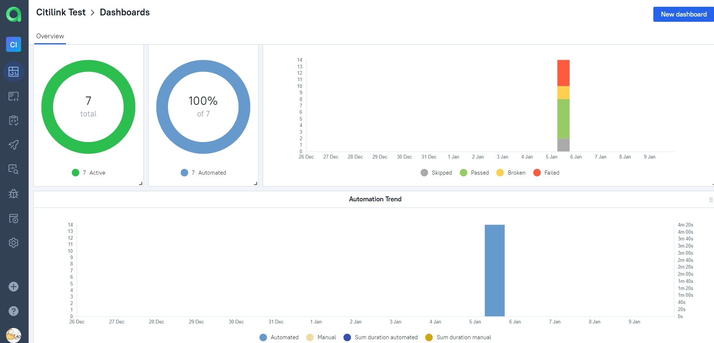
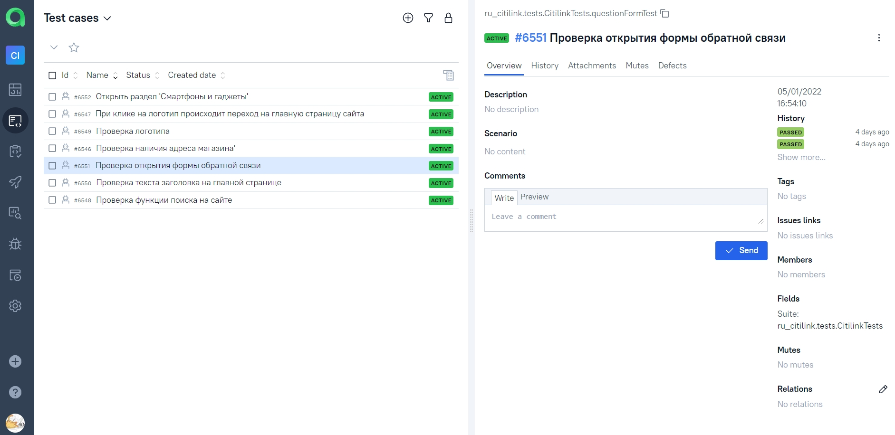
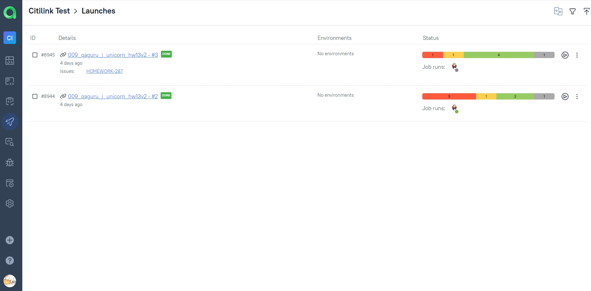
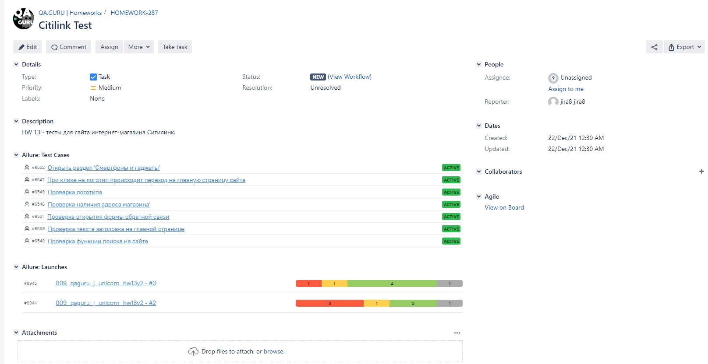
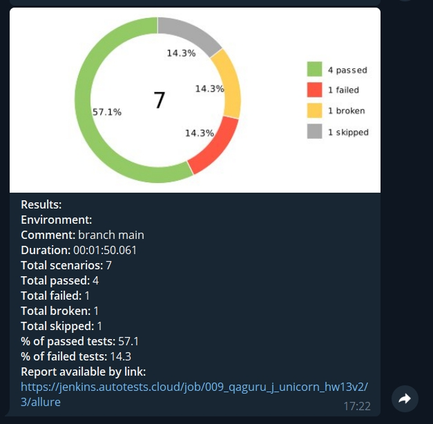

## Проект по разработке автотестов для интернет-магазина [Ситилинк](https://www.citilink.ru/ "Ситилинк").
### Технологический стек
________
           

-----
* Автотесты написаны на ``Java`` с использованием фреймворка ``Selenide``.
* ``JUnit 5`` фреймворк для модульного тестирования.
* ``Gradle`` используется для автоматизированной сборки проекта.
* С помощью ``Jenkins`` выполняется запуск тестов.
* ``Selenoid`` выполняет запуск браузеров в контейнерах ``Docker``.
* ``Allure Report`` формирует отчет о запуске тестов.
* Автотесты интегрируются с тест-менеджмент системой ``Allure TestOps`` и таск-трекер системой ``Jira``
* В ``Telegram`` бот отправляет уведомления о результатах прохождения тестов.

### ✅  Реализованы следующие тест-кейсы
1. Проверка текста заголовка на главной странице.
2. Проверка наличия логотипа на главной странице.
3. Проверка функции поиска товара на сайте.
4. Проверка перехода в раздел "Смартфоны и гаджеты".
5. Проверка наличия адреса магазина.
6. Проверка, что при клике на логотип происходит переход на главную страницу сайта.
7. Проверка открытия формы обратной связи.

### 🚀 Запуск тестов из терминала
* Локально ``gradle clean test -DtypeEnv=locale``
* Удалённо ``gradle clean test -DtypeEnv=remote``

###  Конфигурация Job в Jenkins 
🔴 Открыть сборку [Jenkins](https://jenkins.autotests.cloud/job/009_qaguru_j_unicorn_hw13v2/build?delay=0sec).  
🔴 Нажать **"Собрать с параметрами"**.  
🔴 Указать необходимые параметры.  
🔴 Нажать на кнопку **"Собрать"**.  

  

🔴 Для формирования отчета о прохождении тестов в Allure Report необходимо нажать на ссылку/иконку **"Allure Report"**.  

  

###  Видео прохождения тестов в Selenoid  

<https://user-images.githubusercontent.com/93325839/148690769-79fc4059-f033-4f35-a7be-39214e0dc110.mp4>

###  Отчет о результатах тестирования в Allure Report

  
Подробнее
  

  
**1.** Страница «Overview».

  
  

    
  
**2.** Страница «Categories».  

Данная страница предоставляет информацию о распределении дефектов по их видам.

  

    
  
**3.** Страница «Suites».  

На данной странице представляется распределение выполнявшихся тестов по тестовым наборам или классам, в которых находятся тестовые методы.

  

    
  
**4.** Страница «Graphs».

На этой странице можно получить информацию о тестовом прогоне в графическом виде: статус прогона, распределение тестов по их критичности, длительности прохождения, перезапусках, категориях дефектах.  

  

    
  
**5.** Страница «Timeline».  

Данная страница визуализирует временные рамки прохождения каждого теста.  

  

  

###  Интеграция тестов c тест-менеджмент системой [Allure TestOps](https://allure.autotests.cloud/project/862/dashboards)

  
Подробнее
 

  
📎 **Dashboards.**  

  
  
  

📎 **Test cases.**  

  
  
  

📎 **Launches. Запуски тестов.**  

  
  
  

  

###  Интеграция тестов c таск-трекер системой [Jira](https://jira.autotests.cloud/browse/HOMEWORK-287)  

  
 

###  Уведомления о прохождении тестов в Telegram  

  

